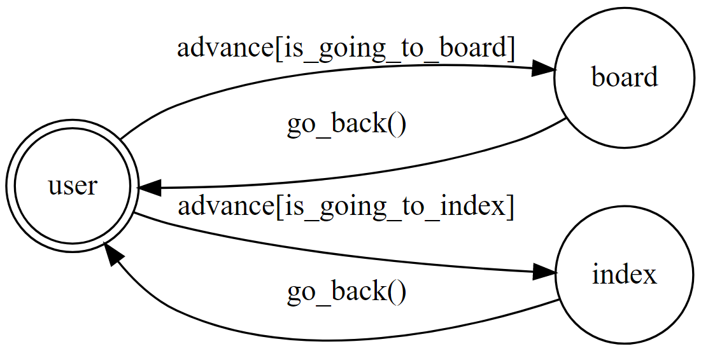

## Dcard_crawler
此機器人可以抓取特定看板中的熱門文章圖片

## Finite State Machine

## Usage
* user
	* Input: "看板名稱 抓取數量"
		* Reply: "該文章標題與連結，及文章裡所有的圖片"

	* Input: "index"
		* Reply: "Show出常用的看板名稱"

## Deploy
Setting to deploy webhooks on Heroku.
